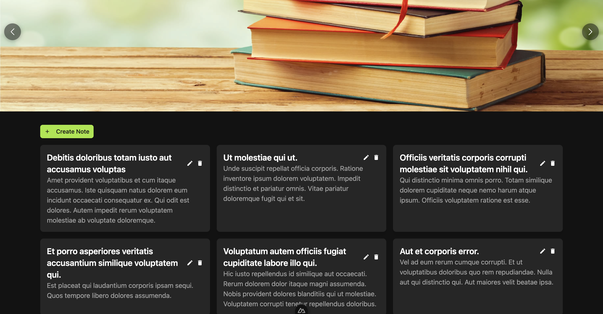
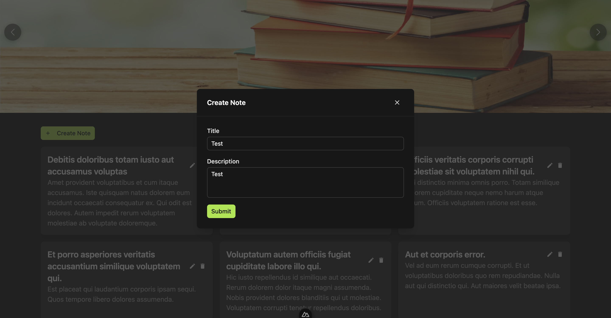
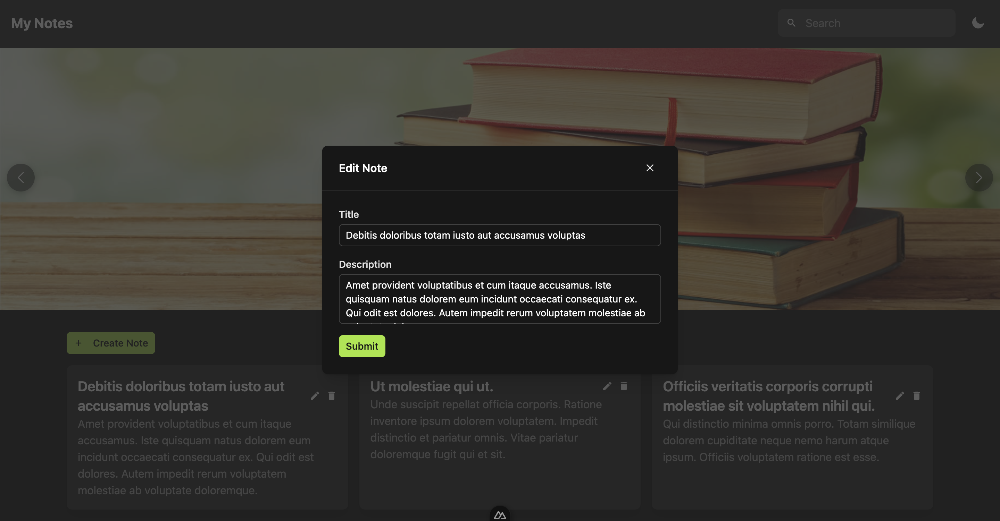
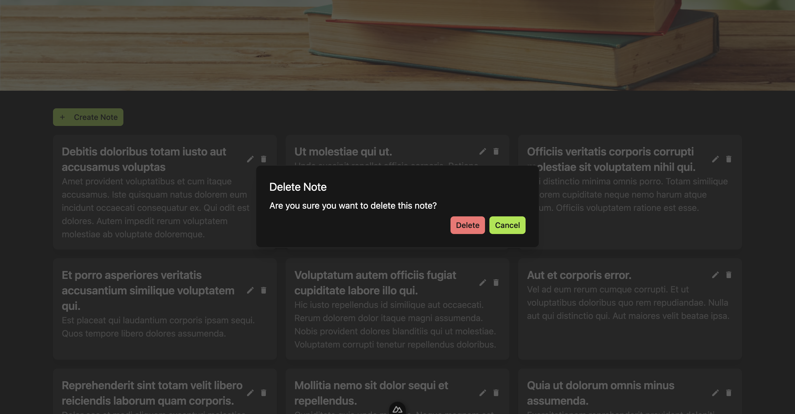
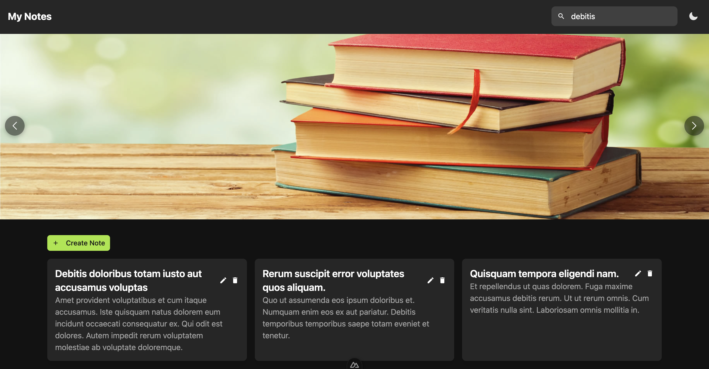

# Notes Web Application

## Overview
A web application for taking notes. The application will allow users to create, read, update, and delete notes.
This is a challenge project for the Redcomm interview process.

## Technologies Used
- Backend: Laravel, PHP, MySQL
- Frontend: Nuxt, Vue.js, JavaScript, Tailwind CSS, HTML, CSS

## Installation
To run this project, you need to have Node.js, PHP, Composer, and MySQL installed on your machine. After installing the required software, clone the repository with the following command:
```bash
git clone https://github.com/resarisyan/redcomm-challenge.git
```
Then, follow the steps below to run the project:

### Backend
1. Navigate to the `backend` directory:
```bash
cd backend
```

2. Install the required packages:
```bash
composer install
```

3. Create a `.env` file by copying the `.env.example` file:
```bash
cp .env.example .env
```

4. Generate the application key:
```bash
php artisan key:generate
```

5. Create a database and update the database configuration in the `.env` file.

6. Run the migrations:
```bash
php artisan migrate
```

7. Seed the database with sample data:
```bash
php artisan db:seed
```

8. Start the server:
```bash
php artisan serve
```

### Frontend
1. Navigate to the `client` directory:
```bash
cd client
```

2. Install the required packages:
```bash
npm install
```

3. Create a `.env` file by copying the `.env.example` file:
```bash
cp .env.example .env
```

4. Update the `API_URL` in the `.env` file to the URL of the backend server.

5. Start the server:
```bash
npm run dev
```
The application should now be running on `http://localhost:3000`.

## License
This project is licensed under the [MIT License](https://opensource.org/licenses/MIT).

## Author
This project is created by Resa Auliana Risyan.

## Acknowledgements
- [Redcomm](https://redcomm.co/)
- [Laravel](https://laravel.com/)
- [Nuxt](https://nuxtjs.org/)
- [Nuxt Ui](https://ui.nuxt.com/)
- [Tailwind CSS](https://tailwindcss.com/)
- [TypeScript](https://www.typescriptlang.org/)

## Additional Notes
This project using php 8.2.0, composer 2.7.1, node 21.6.2, npm 10.2.4, and mysql 5.7.39 Make sure you have the same version or higher to run this project.

## Screenshots
### Home Page


### Create Note


### Edit Note


### Delete Note


### Search Note
